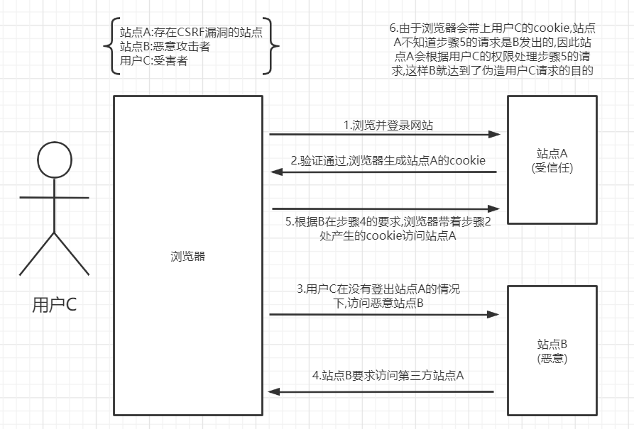

### XSS攻击(Cross Sit Scriping)----跨站脚本攻击

是一种常见的攻击手段之一,攻击者主要通过嵌入恶意脚本程序,当用户打开网页时,脚本程序便在客户端的浏览器中执行,以盗取客户端cookie,用户名密码,下载执行病毒木马程序等.

例:某网站页面有个表单,表单名称为nick,用来向服务器提交昵称信息,value值是用户输入的昵称,比如你吃菜我喝汤,这是正常输入情况,如下:

```html
<input type="test" name ="nick" value="value">
```

可是当用户输入的不是正常的字符串,而是脚本程序,如:

```html
"/><script>alert("脚本")</script><!-"
```

这个表单就变成了:

```html
<iunput type="test" name="nick" value=""/><script>alert("脚本")</script><!-"">
```

这个时候input后面就多了一个script脚本程序,这个脚本程序弹出一个消息框,内容是"脚本",当然这个示例的危害并不大,攻击的危害大小取决于用户植入的脚本.

#### 防御手段

##### 分析: 

XSS之所以能够发生,通过上诉示例中可以看出,用户通过输入代码完成攻击.以html为例,里面包含了大量的"尖括号","单引号","引号"之类的特殊字符.

##### 方案: 

通过上述分析,我们可以对用户输入的数据进行html转译处理来进行防御.

|  <   | \&lt;   |
| :--: | ------- |
|  >   | \&gt;   |
|  '   | \&amp;  |
|  "   | \&auot; |

##### HTML字符转译

如今有很多框架自身提供了转译功能,比如jstl,不需要开发人员进行二次开发

例:使用jstk转译

```html
<c:out value="${nick}" escapeXml="true"></c:out>
```

只需要将escapeXml设置为true就可以将变量nick的值进行转译输出.

2.CSRF(Cross Site Request forgery)全称跨站请求伪造

攻击者盗用你在某网站的身份如cookie,以你的名义向该网站发送恶意请求.这个就比较可怕了,能够利用你的身份发邮件,发短信,甚至转账,盗取账号等.

原理图:



首先用户C访问站点A,然后通过信息验证完成登录,此时产生cookie值保存在浏览器中,然后用户C在没有退出该网站的情况下,无意中访问了恶意的站点B,此时站点B的某个页面带着站点A的cookie向A发出恶意请求,站点A根据请求所带的cookie,判断此请求为用户C发送的,因此处理请求从而完成欺骗.

用户C只需做两件事,CSRF攻击就发生了.

1. 登录某个网站没有退出.
2. 在没有退出的情况下(退出时,session会话结束cookie失效)访问了其他的网站(恶意网站)
3. 有时候所谓的恶意网站,很可能是一个有XSS漏洞的网站

在模拟攻击时,配置对应环境建议在虚拟机中实现,否则本机会被置于风险之中

#### 防御手段

1. 将cookie设置为HttpOnly

   CSRF攻击很大程度上是利用浏览器的cookie,为了防止站点的XSS漏洞盗取cookie,需要在cookie中设置"HttpOnly"属性,这样就无法读取到cookie,避免了攻击者伪造cookie的情况出现.

   在java的serelet的API中设置的代码如下

   ```java
   response.setHeader("Set_Cookie","cookiename=cookievalue;HttpOnly");
   ```

2. 增加token

   攻击者通过盗取cookie来完成安全验证,如果在请求中放入攻击者不能伪造的信息,该信息不再cookie中.

   因此可以在http请求中加入参数token,并在服务端(可在拦截器中校验:session中的tkoen与请求中的token是否一致)校验token,如果token不存在或者存在但不正确,则拒绝请求.

   1. 页面:

   假设请求通过post方式提交,则可以再相应的表单中增加一个隐藏域:

   ```html
   <input type="hidden" name="_token" value=""/>
   ```

   服务端:

   token值在服务端生成,每次会话可以使用相同的token,会话过期token失效,攻击者无法获取token,也就无法伪造请求.

   在session中添加token:

   ```java
   HttpSession session = request.getSession();
   Object token = session.getAttribute("_token");
   if(token==null || "".equals(token)){
       session.setAttrebute("_token",UUID).randomUUID().toString());
   }
   ```

3. 通过Referer识别

   Http协议中,thhp头部有一个字段Referer,它记录了http请求的地址.CSRF通过其他网站发送伪造请求进行攻击,因此可以通过校验该地址是否是该网站发出即可.

   获取Http请求Referer:

   ```java
   String referer = request.getHeader("Referer");
   ```